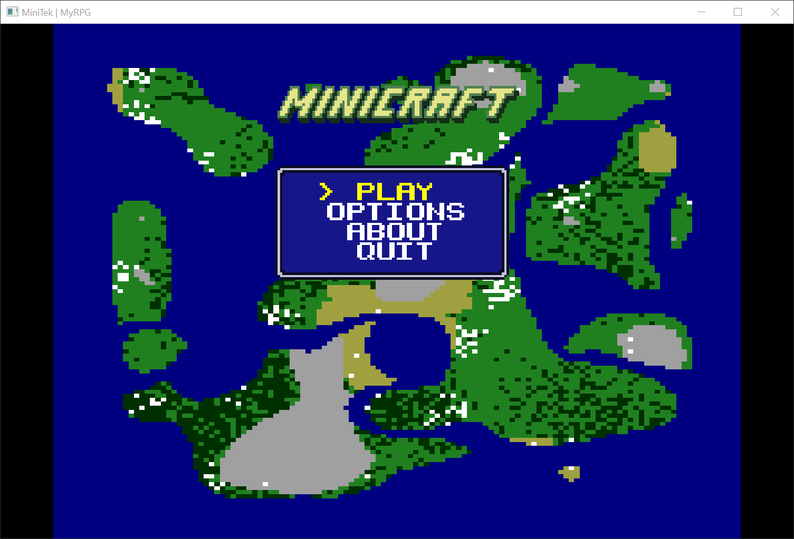
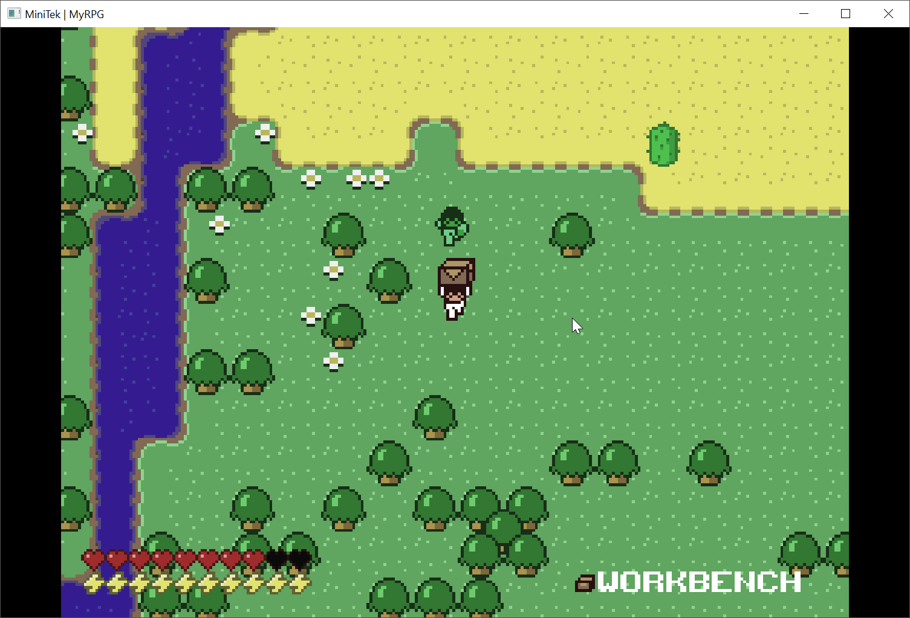

# Minitek

## Minicraft but better :upside_down_face:

Minitek (or MyRPG officially) is a first grade end-year project €pitech.

## About

The goal was to reproduce exactly [Minicraft](http://ludumdare.com/compo/2011/12/17/minicraft/) in C.

We had 4 weeks but with a very poor organization we only had a bit more than one week.

The subject is 6 pages long so here's a summary of the requirements and constraints :

- Collision System
- Particle Engine (i cheated on this one, particles are entities so i did't get the points)
- Menus
- Basic Combat System
- Inventory and status
- Saving system
- "Open" world

But the funniest part nothenless :

- No LibC (`malloc`, `free`, `(f)open`, `(f)read`, `(f)close`, `fwrite`, `memset`, `(s)rand`, `opendir`, `readdir`, `closedir` allowed)
- CSFML Lib for graphics
- LibMath allowed
- **No other external lib is allowed** if you want to do something, code it yourself.

In €pitech projects we need to follow something called "𝓛𝓮 𝓒𝓸𝓭𝓲𝓷𝓰 𝓢𝓽𝔂𝓵𝓮" basically some rules we need to follow but we're **heavily** penalized if we don't follow them, those rules are here to help us produce clean code but tends to produce [this](https://github.com/hollowshiroyuki/minitek/blob/2040ebb1de829b145a84992a8e4e50895295996a/sources/tiles/grass/grass_render.c#L44) kind of attrocities in big projetcs.

You'll see a lot of `printf` in the code as they are ***THE*** way to debug programs i forgot to remove them, i actually got penalized for those. You'll notice no function exceed 20 lines too.

Enough talk here's some screenshots !

## Screenshots

## Installation instructions

You're currently reading the README of the Linux version, for the Windows see [here](https://github.com/hollowshiroyuki/minitek/tree/windows).

Just go to the [releases](https://github.com/hollowshiroyuki/minitek/releases/) section and download the linux build. (i'm too lazy to start my arch, coming soon)

#### Build It !

If you want to build it yourself you'll need `gcc`, `make` and `CSFML` to compile it.

To install the CSFML library please refer to your distribution package repositories.

On Arch you can get it on the AUR with `csfml-bin`.

Clone the repo.

Open the folder in your terminal.

Type `make` and `Enter`.

`? ? ? ? ? ? ? ?`

And done !
